# Scan to BIM project 
This project is a Scan to BIM pipeline that converts 3D scan data (point cloud data) into BIM objects. The conventional process of converting 3D scan data into BIM models is often inefficient, requiring significant time and manual labor. This project was initiated to automate this process and maximize efficiency. It proposes a flexible pipeline that uses a proprietary JSON-based script called SBDL (Scan to BIM Description Language). This allows users to dynamically define and execute processing steps, aiming to automate the entire workflow — from point cloud noise removal and object classification to geometry extraction and final BIM object generation. This project does not cover every Scan to BIM use case, so you may need to adapt the algorithms in each stage to your data. It includes general Scan to BIM use cases for research purposes; for a specific purpose, customization of the pipeline will be needed. Open source doesn't evolve on its own. If you want to contribute, fork and PR.

# description
The Scan to BIM research project has the following goals.</br>
For reference, you can use the [scan to model program (SMP)](https://github.com/mac999/scan_to_model_pipeline.git), a simple 3D point cloud to model pipeline, and the lightweight 3D point cloud segmentation model [PointEdgeSegNet](https://github.com/mac999/point_edge_seg_net) for large-scale point cloud segmentation.
</br>
1. Dynamic implementation of a 3D point cloud processing pipeline using simple SBDL (Scan to BIM Description Language, JSON format).</br>
2. Classification of outdoor building objects such as walls (facades), roads, etc.</br> 
3. Extraction of geometry information from the classification results.</br>
4. Binding BIM objects with geometry information and property sets.</br>
</br>
<p align="center">
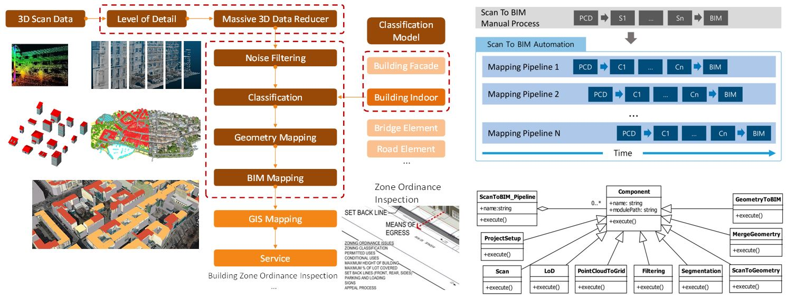</BR>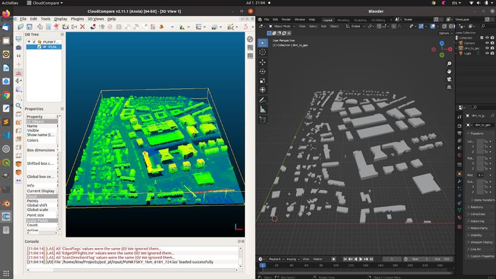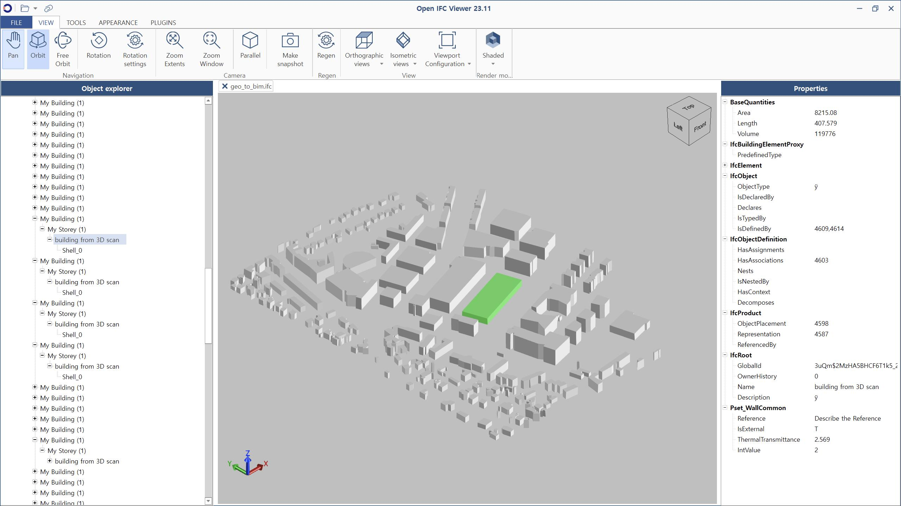</br>
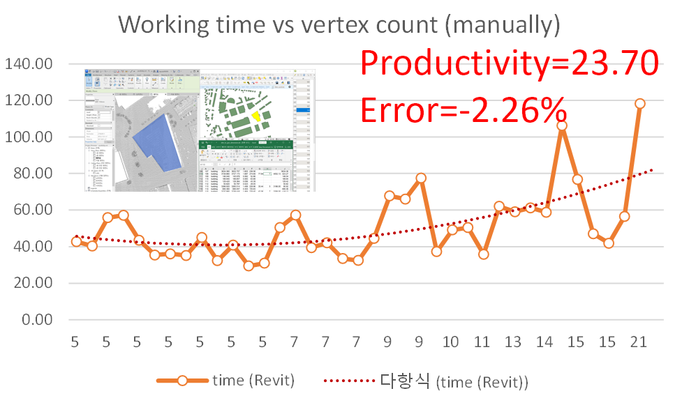
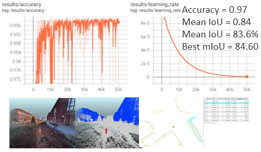</br>
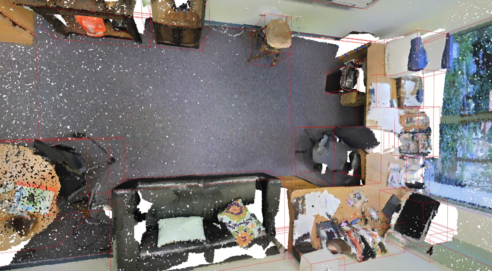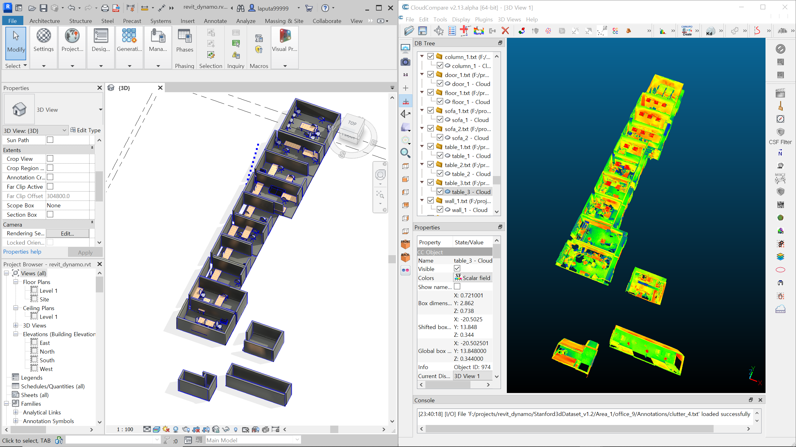
</p>

# version history
v0.1</br>
> 2022.11, Scan to BIM pipeline framework released. Simple SBDL was developed considering geometry computation algorithms to extract outdoor facade objects, deep learning, docker-based components, etc. 

v0.2</br>
> 2023.7, Docker image support. Pipeline revision for processing multiple input files. Refactoring.</br>
> 2023.8, [Data augmentation tool](https://github.com/mac999/pcd_augmentation)</br>
> 2023.9, [LiDAR simulation tool](https://github.com/mac999/simulate_LiDAR)</br>
> 2023.10, [3D scan data quality checker tool](https://github.com/mac999/check_scan_quality)</br>
> 2024.2, Updated pcd_to_DTM and DTM_to_geo modules to fix issues, and added options such as "active", "log_view", "height_building_offset", "height_ground_offest", "max_building_height".</br>

v0.2.1</br>
> 2026.7, Python 3.11 compatibility (removed deprecated/unavailable modules such as telnetlib and readline, Shapely 2.x support, NumPy 1.24+ support). C++ build modernization using find_package(PCL) with cross-platform fixes. Bug fixes in elevation sampling, object classification height axis, and point density computation.</br>

# future update plan
v0.3</br>
> Documentation for SBDL usage.</br>
> Simple MLOps codes for outdoor object training.</br>
</br>

v0.4</br>
> SBDL enhancement supporting VFP (Visual Flow Programming) or LLM (Large Language Model, e.g. ChatGPT).</br>
> Indoor object mapping support update.</br>
> MLOps support.</br>
> Simple scan data processing app using the Scan to BIM pipeline.</br>
> <p>1) deep learning based indoor classification. 2) PCD indoor segmentation. 3) segment to geometry using ML. 4) geometry to BIM using a Revit plugin. 5) 3D data augmentation. 6) LiDAR simulation. 7) 3D PCD quality check.</p>
> <p style="text-align: center;">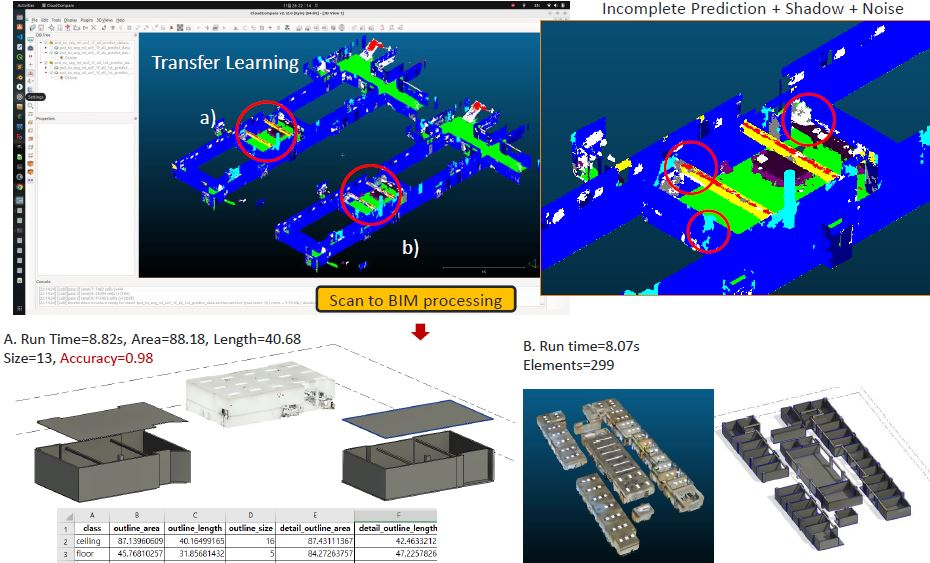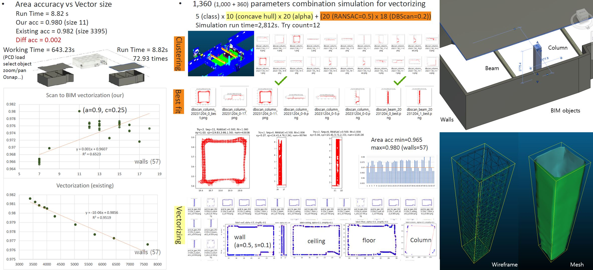</p>

v0.5</br>
> Update PCD to DTM, DTM to Geometry, and Geometry to BIM object source files.</br>

v0.6</br>
> Fix the errors after updating the lasted libraries and algorithms.</br>

# setup development environment & packages 
Python 3.11 is supported (3.9–3.11 recommended).
1. install python and pip</br>
https://www.python.org/downloads/</br>
2. install cmake</br>
https://cmake.org/download/</br>
3. install [cuda](https://developer.nvidia.com/cuda-toolkit-archive) and [pytorch](https://pytorch.org/get-started/locally/) (only required for the deep learning segmentation module)</br>
4. install gdal</br>
https://gdal.org/download.html (with conda: `conda install -c conda-forge gdal`)</br>
5. install pdal</br>
https://pdal.io/en/latest/download.html (with conda: `conda install -c conda-forge pdal`)</br>
In a terminal, run the 'pdal' command. On Ubuntu, if you see the error 'libgdal.so.29: cannot open shared object file', create a symbolic link:</br>
sudo ln -s libgdal.so.30 libgdal.so.29</br>
If the prebuilt pdal has issues, download, build and install pdal from the source on GitHub:
https://github.com/PDAL/PDAL</br>
6. install ifcopenshell</br>
https://pypi.org/project/ifcopenshell/ (`pip install ifcopenshell`)</br>
https://docs.ifcopenshell.org/ifcopenshell-python/installation.html</br>
7. build the docker image (optional, for the deep learning segmentation module)</br>
cd docker</br>
cd build_docker_open3d</br>
bash build_docker.sh</br>

# PCL installation
The C++ modules (pcd_density, pcd_to_seg, seg_to_geo) require PCL. Install the packages below or run 'sh [build_pcl.sh](https://github.com/mac999/scan_to_bim_pipeline/blob/main/build_pcl.sh)'.</br>
sudo apt-get install build-essential g++ python3-dev autotools-dev libicu-dev libbz2-dev libboost-all-dev</br>
sudo apt install libeigen3-dev</br>
dpkg -L libeigen3-dev</br>
sudo apt-get install -y libflann-dev</br>
sudo apt-get install libpcap-dev</br>
sudo apt-get install libgl1-mesa-dev</br>
sudo apt install qtbase5-dev qtchooser qt5-qmake qtbase5-dev-tools</br>
sudo apt install clang-format</br>
sudo apt-get install libusb-1.0-0-dev</br>
sudo apt install libvtk9-dev</br></br>
git clone https://github.com/PointCloudLibrary/pcl pcl-trunk</br>
cd pcl-trunk && mkdir build && cd build</br>
cmake -DCMAKE_BUILD_TYPE=RelWithDebInfo ..</br>
make -j2</br>
sudo make -j2 install</br>

For details, refer to</br>
https://github.com/PointCloudLibrary/pcl</br>
https://pcl.readthedocs.io/projects/tutorials/en/latest/compiling_pcl_posix.html</br>

# build & installation
The build uses find_package(PCL) in [CMakeLists.txt](https://github.com/mac999/scan_to_bim_pipeline/blob/main/CMakeLists.txt), so an installed PCL is found automatically. If PCL was built from source without installing, pass its build directory with `-DPCL_DIR=/path/to/pcl/build`. For reference, PCL-1.13 has a memory error (handmade_aligned_free) related to the eigen library (2023/4/10); PCL-1.12 is recommended.</br>
</br>
In a terminal, enter the commands below.</br>
git clone https://github.com/mac999/scan_to_bim_pipeline</br>
cd scan_to_bim_pipeline</br>
pip install -r requirements.txt</br>
mkdir build</br>
cd build</br>
cmake ..</br>
make</br>
</br>
If there are dependency errors with requirements.txt, use requirements_simple.txt.

# run
Before running, install requirements_simple.txt (or requirements.txt) including the packages above.</br>
1. Modify /pipeline/config.json considering your input and output folder paths. For reference, the root folder name is scan_to_bim_pipeline, which you downloaded and installed from GitHub.</br>
```
{
    "app": "pcd_pipeline",
    "root_path": "./pipeline/",
    "bin_path": "./",
    "lib_path": "./lib/",
    "data_path": "./input/",
    "debug_gui": false
}
```
2. Download the input sample files and copy them into the ./input folder. Refer to the [sample dataset](https://drive.google.com/drive/folders/1Jb32VkVEuhkKKZ8XVE9E8RLUw2S-VfSd).</br>
3. Run app.py as below.</br>
python ./pipeline/app.py</br>
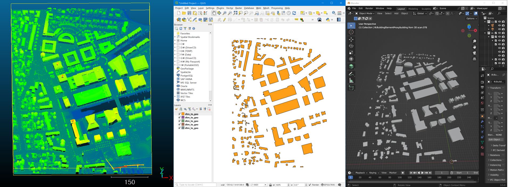</br>
4. Or design a pipeline using SBDL (Scan to BIM Description Language) formatted as JSON like below.</br>
  pipeline.[name]={stage*}</br>
  stage={module_type, parameters}</br>
  parameters={name, value}*</br>
  module_type={python program | docker image | binary executable program}</br>
  * parameters should be defined in the module before usage.</br>
  condition={"in_stage_return", "out_stage_return"}</br></br>

An example Scan to BIM pipeline using SBDL:</br>
pipeline.indoor_obb_extraction = data_to_format > pcd_to_seg > pcd_to_clean > seg_to_geo</br>
pipeline.indoor_obb_extraction(*.las) > *.geojson</br>
</br>
```
{
    "pipeline.indoor_obb_extraction": [
        {
            "type": "data_to_format",
            "active": true,
            "output_type": ".pcd"
        },
        {
            "type": "pcd_to_seg",
            "iteration": "1000", 
            "threshold": "0.1",
            "projection": "true",
            "remove_overlap_distance": "0.10",
            "min_points_ratio": "0.2"
        },
        {
            "type": "pcd_to_clean",
            "voxel_down_size": "0.0",
            "nb_radius_points": "50",
            "nb_radius": "0.1"
        },
        {
            "type":"seg_to_geo",
            "alpha": "0.15"
        }
    ]
}
```
</br>
cd pipeline</br>
python app.py</br>

# sample dataset
Download a dataset and copy it to the /input folder.</br> 
3D point cloud sample file [download](https://drive.google.com/drive/folders/1Jb32VkVEuhkKKZ8XVE9E8RLUw2S-VfSd)</br>
National LiDAR map [National Map](https://apps.nationalmap.gov/lidar-explorer/#/)</br>
Open Topography [LiDAR map](https://portal.opentopography.org/lidarDataset?opentopoID=OTLAS.052010.26910.1&minX=-122.26765250953395&minY=38.098874920746226&maxX=-122.25515556338722&maxY=38.10795230920854)</br>
Pix4D dataset [Download](https://support.pix4d.com/hc/en-us/articles/360000235126-Example-projects-real-photogrammetry-data#OPF3)</br>
LAS map files [arcgis map link](https://www.arcgis.com/apps/webappviewer/index.html?id=8a7ca254395f424a8bd4c1c8c7a21acb)</br>
LiDAR files [USGS gov](https://www.usgs.gov/faqs/what-lidar-data-and-where-can-i-download-it)</br>
Top 6 Free LiDAR Data Sources [LiDAR files](https://gisgeography.com/top-6-free-lidar-data-sources/)</br>

# architecture
SBDL concept diagram and [UML](./doc/SAD.uml) architecture.</br>
<p align="center">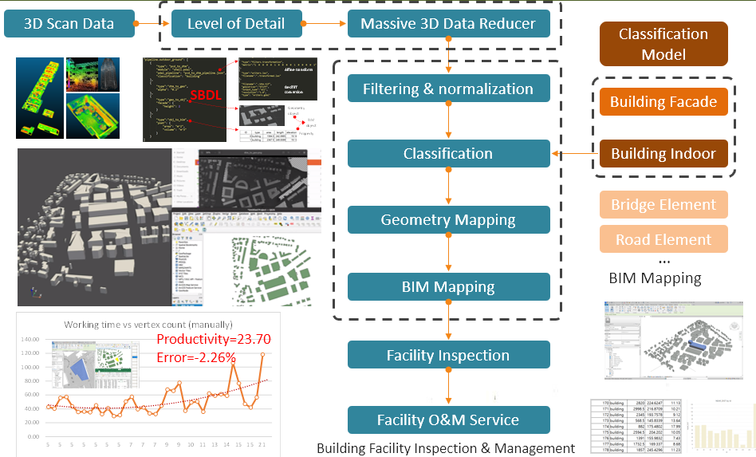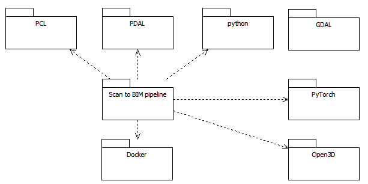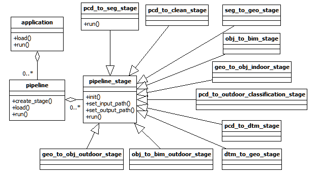</p>

# license
MIT license.</br></br>
Acknowledgment.</br>
> Scan To BIM Technology Development 3D Urban Building Model Process Automation, 2022</br>
> 3D vision & AI based Indoor object Scan to BIM pipeline for building facility management, 2023</br>
Funded by KICT</br></br>
Organization Roles</br>
> KICT: Scan to BIM pipeline architecture design, algorithm programming, test, code management</br></br>
Special thanks for contributions as below</br>
> IUPUI (Prof. Koo Dan, Prof. Kwonsik Song), UNF (Prof. Jonghoon Kim): use case, code, policy survey</br>
> Purdue University (Prof. Kyubyung Kang): deep learning training, dataset collection, labeling, analysis</br>
> Stony Brook University (Prof. Jongsung Choi): data collection using SLAM, labeling, analysis</br>
</br>
Kang, TW., Patil, S., Kang, K., Koo, D. and Kim, J., 2020. Rule-based scan-to-BIM mapping pipeline in the plumbing system. Applied Sciences, 10(21), p.7422. https://www.mdpi.com/2076-3417/10/21/7422</br>
Kang, TW., 2023, Scan to BIM Mapping Process Description for Building Representation in 3D GIS, Applied Sciences. 13(17), https://www.mdpi.com/2076-3417/13/17/9986
